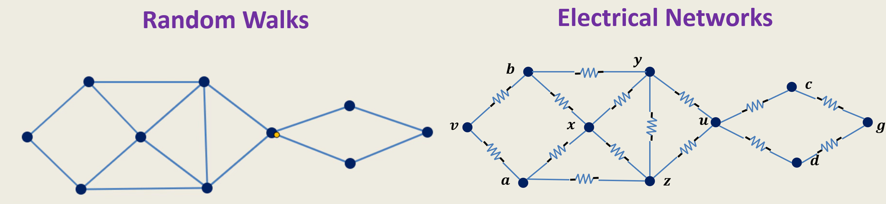
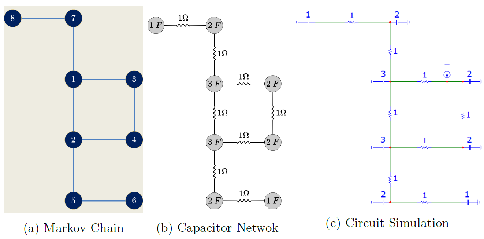
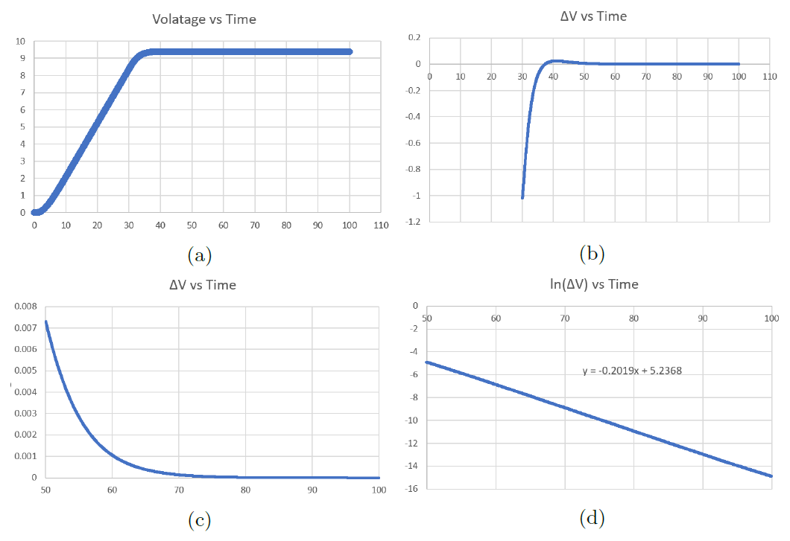

# Randomized Algorithms: Walks, Chains, and Networks

An exploration into the deep connections between randomized algorithms and electrical network theory. This project studies two key analogies:
1.  **Random Walks on Graphs** ↔ **Resistor Networks** (Derivation of Hitting & Commute Time)
2.  **Markov Chains** ↔ **Capacitor Networks** (Relaxation Time)


## 1. Random Walks & Electrical Networks



We model a graph as an electrical network, replacing each edge with a **resistor**. This allows us to analyze random walk properties like **hitting time** ($H_{uv}$) and **commute time** ($C_{uv}$) using electrical concepts.

* **Commute Time Formula**:
$C_{uv} = 2m \cdot R_{uv}$
where $m$ is the number of edges and $R_{uv}$ is the effective resistance between $u$ and $v$.

Here's an example of a graph as an electrical network:

## 2. Markov Chains & Capacitor Networks



This analogy links the **relaxation time** ($\tau_{rel}$) of a Markov chain (how fast it mixes) to the dissipation time in a related **RC circuit**.

* **Relaxation Time**: $\tau_{rel} = \frac{1}{1 - \lambda_2}$ (where $\lambda_2$ is the second largest eigenvalue of the transition matrix).

By constructing a network with capacitors at states and resistors representing transition probabilities, we demonstrate the relation between both.

* **Experimentation**

The results are verified by experimental plots confirming the equivalence.



## Directory Structure

```
├── Capacitor and Markov Chains.pdf
├── Presentation.pptx
├── README.md
├── Resistor and Commuter Time.pdf
├── images
│   ├── capacitor.png
│   ├── plots.png
│   └── resistor.png
└── src
    ├── README.md
    ├── commute.ipynb
    ├── hell-heaven.ipynb
    └── helpers.py
```

## License

[MIT License](LICENSE)
